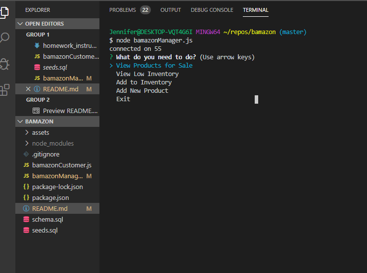
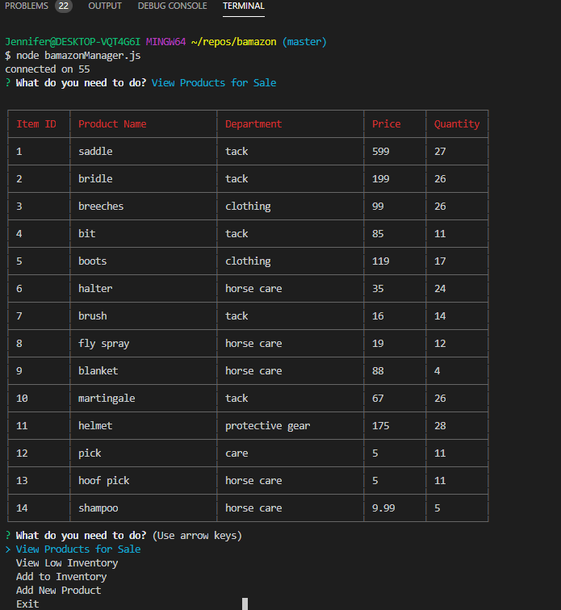
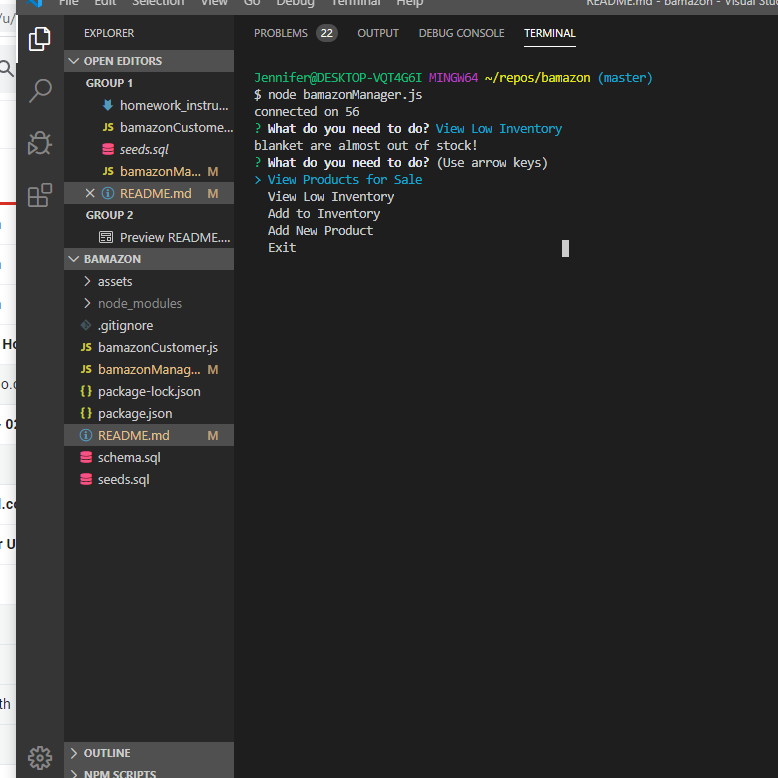
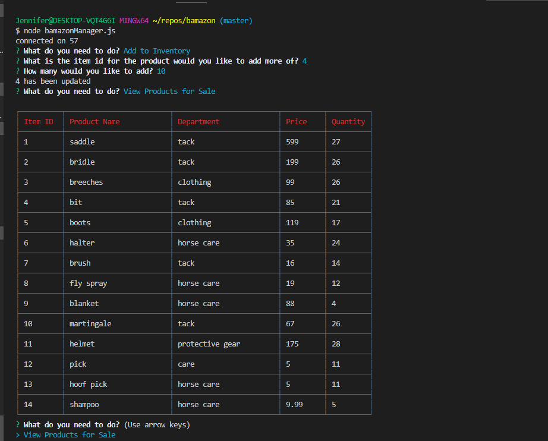
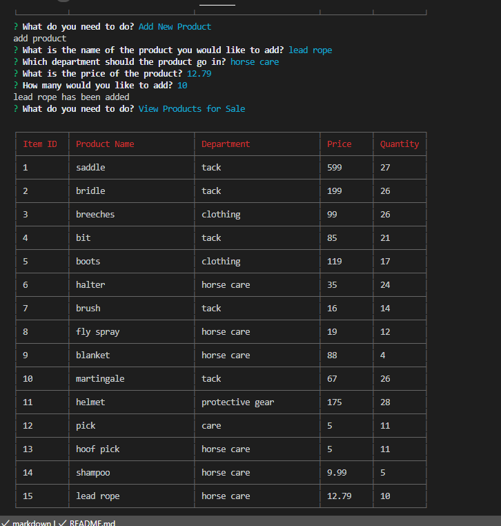

# bamazon

Bamazon is a command-line storefront app. The first part asks the user which item they would like to purchase, how many of that item they would like to purchase, and the total cost of the purchase. It then updates the database to reflect how many of each item is left in stock after a purchase. The second part provides a manager's view of the items in the storefront. It allows a manager to see the details of the products, check if inventory is low, add to the stock, and add new items.

## To Start This App
Npm packages will be necessary to run bamazon. Open your terminal and install:
* NPM
* Mysql
* Inquirer

A Mysql database will also be necessary. Using Mysql Workbench, create a database called 'bamazon'. Use the schema.sql file to create the table needed for this app and the seed.sql file to populate a few rows. Add additional data to the table if needed. 

## To Use This App
#### Customer View
Using the command-line, run bamazonCustomer.js. This will display the table of products available. A prompt will ask the id of the product the user would like to purchase. After the id is entered, a prompt will ask the user how many if the items they would like to purchase. After this information is entered, the app will tell the user if there is enough of the item in stock and the total cost of the order.

#### Manager View
Using the command-line, run bamazonManager.js. Five options are available.

* View Products for Sale: This option shows a table with all of the products and their details displayed.

* View Low Inventory: This option allows the manager to check which items have less than 5 in stock.

 

* Add to Inventory: This option allows the manager to add more of an item that is already part of their inventory.

* Add New Product: This option allows the manager to add a new item to their inventory.

* Exit: Ends the program and disconnects from the database.

## Built With
* Javascript
* Node
* Mysql
* NPM
* Git
* GitHub

### Code written by: Jennifer Moundanos